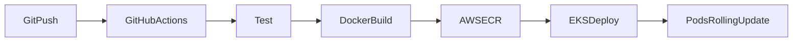

# my-app — CI/CD to EKS

Express microservice with an automated pipeline: **GitHub Actions → Docker → AWS ECR → Amazon EKS**, using rolling updates and health checks for zero-downtime deploys.

## Architecture



| Stage | What happens |
|-------|----------------|
| **Test** | `npm ci` and `npm test` (Supertest against `/` and `/health`) |
| **Build & push** | Docker image tagged with `git sha` and `latest`, pushed to ECR |
| **Deploy** | `kubectl set image` + `kubectl rollout status` on the `my-app` Deployment |

Pull requests run **test** and a **Docker build** (no push or deploy). Pushes to `main` run the full pipeline.

## Prerequisites

- AWS account with:
  - ECR repository (default name: `my-app`)
  - EKS cluster with the app namespace (default: `default`)
- One-time apply of Kubernetes manifests (after the first image exists in ECR, or use a bootstrap tag):

```bash
kubectl apply -f deployment.yaml
kubectl apply -f service.yaml
```

## GitHub configuration

### Repository variables (`Settings → Secrets and variables → Actions → Variables`)

| Variable | Example |
|----------|---------|
| `AWS_REGION` | `us-east-1` |
| `ECR_REPOSITORY` | `my-app` |
| `EKS_CLUSTER_NAME` | `my-cluster` |

### Secrets

| Secret | Description |
|--------|-------------|
| `AWS_ROLE_ARN` | IAM role ARN for GitHub OIDC (see below) |

### GitHub OIDC → AWS (recommended)

1. Create an OIDC identity provider in IAM for `token.actions.githubusercontent.com` (audience `sts.amazonaws.com`).
2. Create an IAM role trusted by your repo, e.g. `repo:YOUR_ORG/my-app:ref:refs/heads/main`.
3. Attach a policy allowing ECR push and EKS describe/update, for example:

- `ecr:GetAuthorizationToken` (resource `*`)
- ECR push APIs on `arn:aws:ecr:REGION:ACCOUNT:repository/my-app`
- `eks:DescribeCluster` on your cluster

4. Grant the role Kubernetes access via **EKS access entries** (or legacy `aws-auth` ConfigMap) so the deploy job can run `kubectl`.

Store the role ARN in `AWS_ROLE_ARN`.

### Access keys (fallback)

Replace the `configure-aws-credentials` step inputs with `aws-access-key-id` and `aws-secret-access-key` from repository secrets instead of `role-to-assume`.

## Local development

```bash
npm install
npm test
npm start   # node server.js — listens on port 3000
```

```bash
docker build -t my-app:local .
docker run -p 3000:3000 my-app:local
```

## Verify a deployment

1. Push to `main` and confirm all jobs pass in the **Actions** tab.
2. On the cluster:

```bash
kubectl get pods -l app=my-app
kubectl rollout history deployment/my-app
```

3. Reach the app (NodePort example):

```bash
kubectl port-forward service/my-app 3000:3000
curl http://localhost:3000/health
```

## Resume bullet (example)

Designed and implemented a GitOps-style CI/CD pipeline using GitHub Actions, Docker, Amazon ECR, and EKS, with automated tests and rolling deployments backed by readiness/liveness probes on `/health`.

## Upgrade paths

- **GitOps:** Kustomize `images:` patches committed after each deploy instead of `kubectl set image`.
- **Ingress:** Add AWS Load Balancer Controller Ingress instead of NodePort.
- **IaC:** Terraform for ECR, EKS, and the GitHub OIDC IAM role.
